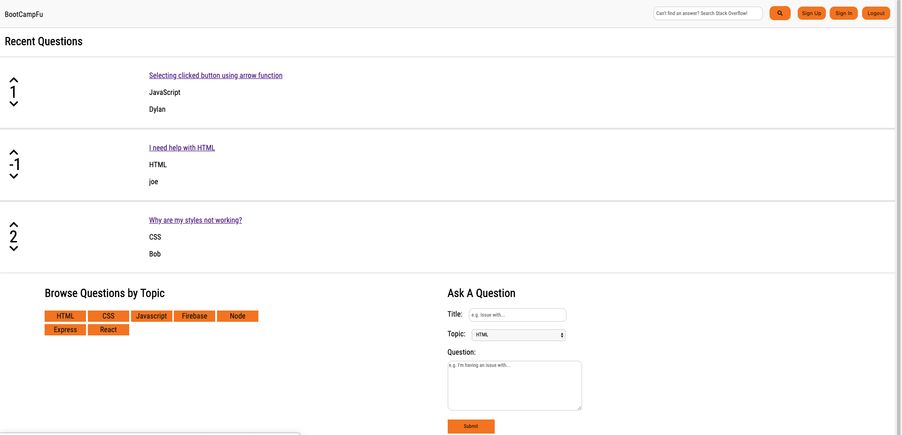

# BootcampFu

## Coding Q&A Site for Trilogy Bootcamp Students

[Live Site](https://nameless-eyrie-66645.herokuapp.com/)

## Guest Account
If you want to try the site but do not wish to create an account, sign in using these credentials:
* Email: `guestaccount@guest.com`
* Passowrd: `Gu3$t`

BootcampFu is a question/answer forum for Trilogy coding bootcamp students. Students can create accounts and post questions and answers to topics related to the Trilogy curriculum. Users are also able to upvote or downvote questions and answers to reflect whether they thought that particular post was helpful to them. Inspired by [Stack Overflow](https://stackoverflow.com/).

## Packages used: 
* [express](https://www.npmjs.com/package/express) - Web Server
* [express-handlebars](https://www.npmjs.com/package/express-handlebars) - Generating HTML pages
* [mysql](https://www.npmjs.com/package/mysql) - Database
* [Sequelize](http://docs.sequelizejs.com/) - Object-relational mapping with MySQL
* [Passport.js](http://www.passportjs.org/) - User authentication
* [express-session](https://www.npmjs.com/package/express-session) - Tracking session data for login
* [bcrypt](https://www.npmjs.com/package/bcrypt) - Encrypting user passwords
* [connect-flash](https://www.npmjs.com/package/connect-flash) - Store messages in sessions i.e. "Email already taken"
* [dotenv](https://www.npmjs.com/package/dotenv) - Create an environment file for hiding sensitive data

## Libraries/Frameworks used:
* [SASS](https://sass-lang.com/) - Style sheet language for building CSS
* [jQuery](https://jquery.com/) - DOM manipulation and AJAX
* [Font Awesome](https://fontawesome.com/) - Icons
* [code-prettify](https://github.com/google/code-prettify) - Syntax highlighting for code snippets on HTML pages

## Challenges
The main challenge was coming up with a concept and building a [minimum viable product](https://en.wikipedia.org/wiki/Minimum_viable_product) within two weeks. After our group discussed a number of different ideas, we all settled on something that we thought we could accomplish in that time frame.

Group work comes with its own challenges. We had to mitigate tasks based on our individual strengths, and communicate regularly. Stand-up meetings were conducted every day or two in order to ensure that all team members were communcicating and coordinating effectively. 

We used a number of technologies in this project that we were previously unfamiliar with. As a result, a good deal of time was spent reading documentation.

Designing the database schema for the overall website was a challenge as it was more complicated than previous projects. It helped tremendously to map out the tables and their relationships before defining them.

## Potential Changes
* Display user's questions and answers on dashboard and allow them to update or delete their posts
* Account management for changing email, password, etc.
* Interface enhancements
* Notifications/Alerts

## BootcampFu API
### Users
* GET `/api/users` returns JSON object containing all users in the following format:
   * username
   * id
   * status
   * Questions (array)
   * Answers (array)
 * GET `/api/users/:id` returns JSON object conataining the above information for the user with id of `:id`
 
 ### Questions
 * GET `/api/questions` returns JSON object containing all questions in the following format:
   * id
   * title
   * text
   * score
   * topic
   * createdAt
   * updatedAt
   * UserId
   * User
   * Answers (array)
 * GET `/api/questions/:id` returns JSON object for the question with id of `:id`
 * GET `/api/questions/topic/:topic` returns JSON object for all questions for a particular topic in the above format. Current topics include:
   * HTML
   * CSS
   * JavaScript
   * Firebase
   * Node
   * Express
   * React
### Answers
* GET `/api/questions/:questionId/answers` returns JSON object for all answers to the questions with an id of `:questionId` in the following format:
   * id
   * text
   * score
   * createdAt
   * updatedAt
   * QuestionId
   * UserId
   * User
   * Question
* GET `/api/questions/:questionId/answers/:answerId` returns JSON object for answer with id of `:answerId` belonging to question with id of `:questionId`

## How To Clone
* Open terminal to directory you wish to clone into and run `git clone https://github.com/Dylan-Thomson/BootCampFu.git`
* Install modules by running `npm install`
* Create a MySQL database using `schema.sql` using MySQL workbench or another tool of your choice
* Create a `.env` file with the following lines:
    * LOCAL_DB_PASSWORD = "your-database-password"
    * SESSION_SECRET = "your-session-secret"
* Run the application by entering `node server.js` into your terminal
* Open browser and type `localhost:3000` (or whatever port number you are using)
